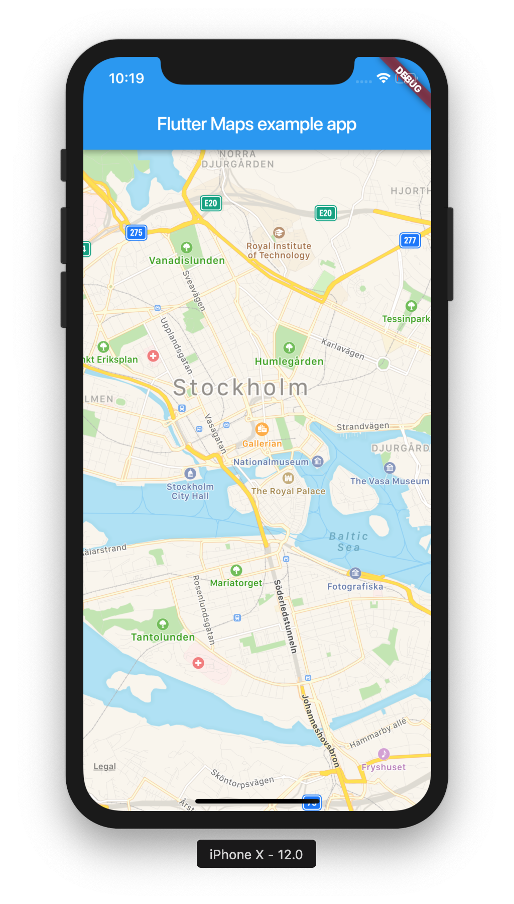
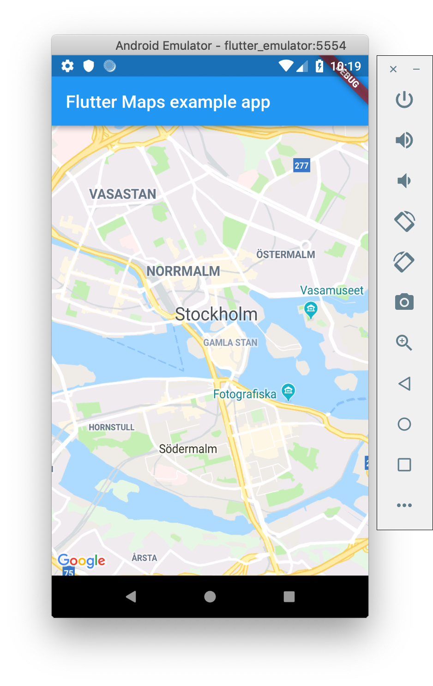

# Maps for Flutter

Native maps for Flutter, embedded as a native view using the PlatformView API.

| **iOS** (Apple Maps)   | **Android** (Google Maps)      |
| ---------------------- | ------------------------------ |
|  |  |

## Setup

Setup works as for any Flutter plugin, expect the caveats outlined below:

### iOS

Since the PlatformView api is still only a preview, you need to set the following key to true in your `Info.plist`:

```xml
<plist>
<dict>

  <key>io.flutter.embedded_views_preview</key>
  <true/>

</dict>
</plist>
```

### Android

Google Maps requires that you [get an API key](https://developers.google.com/maps/documentation/android-sdk/signup), place it in your `AndroidManifest.xml`:

```xml
<manifest>
  <application>

    <meta-data
      android:name="com.google.android.geo.API_KEY"
      android:value="YOUR API KEY HERE" />

  </application>
</manifest>
```

## Features

Currently no features at all are implemented, it only shows an empty map not centered on anything in particular.

The goal is to follow [`google_maps_flutter`](https://github.com/flutter/plugins/tree/master/packages/google_maps_flutter) closely, and have the same features where it makes sense and can be reasonably implemented on both iOS and Android.
